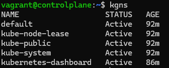
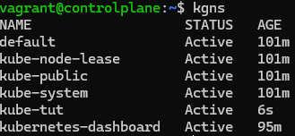

## Namespace

Kubernetes namespace is considered to be an isolation as multiple virtual clusters. Objects in different namespaces are invisible to each other. This is useful when different teams or projects are sharing the same cluster. Namespace is also very important for resource management and role.
Kubernetes has three namespaces by default:
- default
- kube-system
- kube-public
Without explicitly assigning namespace to the namespaced resource, it will be located in the namespace under current context. If we never add a new namespace, a default namespace will be used.
By default, the kubectl command-line tool interacts with the *default* namespace. If you want to use a different namespace, you can pass kubectl the --namespace flag.
*$ kubectl --namespace=mystuff* 
references objects in the mystuff namespace.

Kube-system namespaces are used by the objects created by the Kubernetes system, such as addon, which are the pods or services that implement cluster features, such as dashboard. 
Kube-public namespaces are newly introduced in Kubernetes 1.6, which is used by a beta controller manager, putting the signed cluster location information into the kube-public namespace, so this information could be visible to authenticated/unauthenticated users.

Let's create a namespace for this tutorials called *kube-tut*.
- Before that check what all namespaces (will refer as ns going ahead) are already there:
  *$ kgns*
  
- Below command will create the ns kube-tut:
  *$ k create ns kube-tut*
- Check if ns created successfully:
  *$ kgns*
  
- To delete this ns: 
  *$ krmns kube-tut*

To do the same in Declarative Approach, lets create a manifest file.Then apply the manifest:
*$ ka ns.yaml*

Please note that creating the namespace will not make sure the further k8s objects defined will be inside this ns. We need to exclusively define the ns name. Alternatively we define and use context.