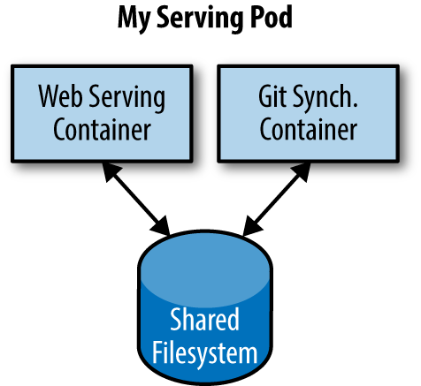
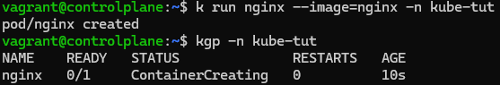
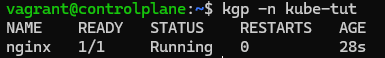
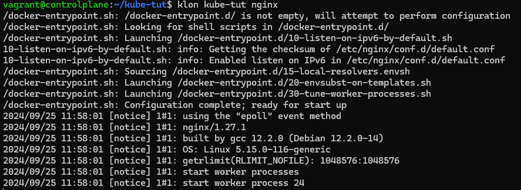
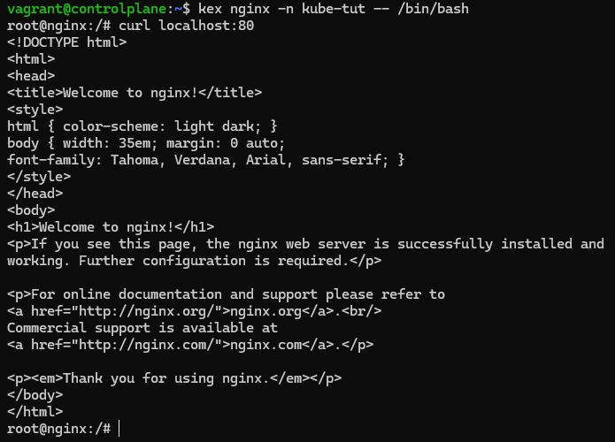
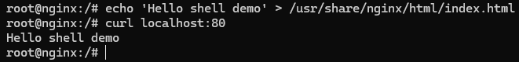

- [Pods ](#pods-)
- [Simple nginx pod using k run ](#simple-nginx-pod-using-k-run-)

## Pods <a name="Pods"></a>

In real-world deployments of containerized applications you will often want to colocate multiple applications into a single atomic unit, scheduled onto a single machine. A canonical example of such a deployment is illustrated in Figure below, which consists of a container serving web requests and a container synchronizing the filesystem with a remote Git repository.


On one hand, the two different containers have significantly different requirements in terms of resource usage. 
On another hand, The two containers are quite symbiotic; it makes no sense to schedule the web server on one machine and the Git synchronizer on another. Consequently, Kubernetes groups multiple containers into a single,
atomic unit called a Pod. (The name goes with the whale theme of Docker containers, since a Pod is also a group of whales.)
A Pod represents a collection of application containers and volumes running in the same execution environment. Pods, not containers, are the smallest deployable artifact in a Kubernetes cluster. This means all of the containers in a Pod always land on the same machine. Each container within a Pod runs in its own cgroup, but they share a number of Linux namespaces. Applications running in the same Pod share the same IP address and port space (network namespace), have the same hostname (UTS namespace), and can communicate using native interprocess communication channels over System V IPC or POSIX message queues (IPC namespace). However, applications in different Pods are isolated from each other; they have different IP addresses, different hostnames, and more. Containers in different Pods running on the same node might as well be on different servers.
Applications that are symbiotic must be kept in the same machine, so need to be in same pod. For example you have a webapp that you want to host and use nginx as reverse proxy and resource limiter. So you need to deploy them in the same pod.
However if you have to deploy a wordpress container and a database container, even if they are on different pods (or server), it won't be an issue.

One of the first things you learn when beginning working with Kubernetes is that each Pod is assigned a unique IP address and a hostname. Furthermore, containers within a Pod can communicate with each other via localhost. Thus, it quickly becomes clear that a Pod resembles a server in miniature. Current version of Kuberenetes support only 2 pod OS: Windows and Linux.

*In general, the right question to ask yourself when designing Pods is, “Will these containers work correctly if they land on different machines?” If the answer is “no,” a Pod is the correct grouping for the containers.*

## Simple nginx pod using k run <a name="simple-nginx-pod-using-k-run"></a>
```
$ k run nginx --image=nginx -n kube-tut
```


The status of our example pod is ContainerCreating. In this phase, Kubernetes has accepted the request, trying to schedule the pod and pulling down the image. Zero containers are currently running. After waiting a moment, we could get the status again:


Let's try the same using hybrid mode. First we create a pod using k run, and create a manifest file. Then edit the file.
```
$ k run nginx --image=nginx --restart=Never -n kube-tut -o yaml > pod.yaml
```
Edit the pod.yaml file. Then delete the existing pod, and apply the manifest
```
$ krmp nginx -n kube-tut
$ ka pod.yaml
```

Let's check the logs of the pod:
```
$ klon kube-tut nginx
```
 

To see container level log use -c flag with the container name:
```
$ klon kube-tut nginx -c nginx
```

Let's try to get a shell to the running container:
```
$ kex nginx -n kube-tut -- /bin/bash
```



Do you think we can access the pod simple-service from outside of Kubernetes, without changing the manifest?
The answer is no, the pod is only visible from the inside of the container. To access it from outside, we will need to create a service.

Multiple containers within the pod access each other through a loopback address(localhost).

For now we donot need to clean up the pod, as it will be needed ahead.
But you can perform clean up in 2 ways:
```
$ krmp nginx -n kube-tut
$ k delete -f kube-tut/pod.yaml
```
