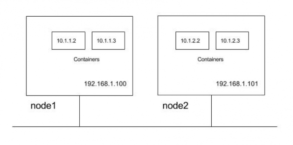
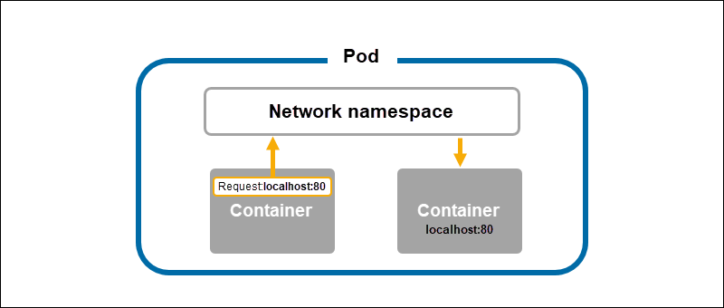
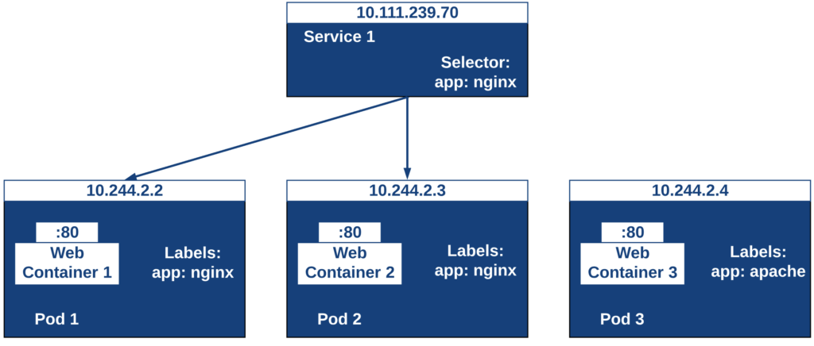

- [Kubernetes Networking Model](#kubernetes-networking-model)
  - [Container-to-Container Communication](#container-to-container-communication)
  - [Pod-to-pod Communication](#pod-to-pod-communication)
  - [Pod-to-service Communication](#pod-to-service-communication)
- [Service](#service)
  - [ClusterIP](#clusterip)
  - [NodePort](#nodeport)
  - [Load Balancer](#load-balancer)
  - [ExternalName](#externalname)


## Kubernetes Networking Model

The Kubernetes networking model is based on a flat address space. All pods in a cluster can directly see each other. Each pod has its own IP address. There is no need to configure any NAT. In addition, containers in the same pod share their pod's IP address and can communicate with each other through localhost.
One of the important areas of managing Kubernetes network is to forward container ports internally and externally to make sure containers and Pods can communicate with one another properly. To manage such communications, Kubernetes offers the following four networking models:

- Container-to-Container communications
- Pod-to-Pod communications
- Pod-to-Service communications
- External-to-internal communications

Kubernetes imposes the following fundamental requirements on any networking implementation (barring any intentional network segmentation policies):
- All pods can communicate with all other pods without NAT
- All nodes running pods can communicate with all pods (and vice-versa) without NAT
- IP that a pod sees itself as is the same IP that other pods see it as

For the illustration of these requirements let say we have a cluster with two nodes. Nodes are in subnet 192.168.1.0/24 and Pods use 10.1.0.0/16 subnet, with 10.1.1.0/24 and 10.1.2.0/24 used by node1 and node2 respectively for the Pod IP’s.



So from above, Kubernetes requirements following communication paths must be established by the network.

- Nodes should be able to talk to all pods. For e.g. 192.168.1.100 should be able to reach 10.1.1.2, 10.1.1.3, 10.1.2.2 and 10.1.2.3 directly (without NAT)
- A Pod should be able to communicate with all nodes. For e.g. Pod 10.1.1.2 should be able to reach 192.168.1.100 and 192.168.1.101 without NAT
- A Pod should be able to communicate with all Pods. For e.g 10.1.1.2 should be able to communicate with 10.1.1.3, 10.1.2.2 and 10.1.2.3 directly (without NAT)

### Container-to-Container Communication

When two (or more) containers reside on the same pod, the containers share a network namespace. A hidden container called the Pause container holds the network namespace for a pod. The Pause container sets up the namespace, creating shared resources for all containers in a pod.



Due to the shared network namespace, containers in the same pod can communicate through localhost and port numbers. Each container in the same pod should have a unique communication port to avoid port conflicts.

### Pod-to-pod Communication

Pods in Kubernetes are allocated a network-visible IP address (not private to the node). Pods can communicate directly without the aid of network address translation, tunnels, proxies, or any other obfuscating layer. Well-known port numbers can be used for a configuration-free communication scheme. The pod's internal IP address is the same as its external IP address that other pods see (within the cluster network; not exposed to the outside world). That means that standard naming and discovery mechanisms such as DNS work out of the box.

### Pod-to-service Communication
Pods can talk to each other directly using their IP addresses and well-known ports, but that requires the pods to know each other's IP addresses. In a Kubernetes cluster, pods can be destroyed and created constantly. The service provides a layer of indirection that is very useful because the service is stable even if the set of actual pods that respond to requests is ever-changing. In addition, you get automatic, highly available load balancing because the Kube-proxy on each node takes care of redirecting traffic to the correct pod.

## Service
Service is the method for exposing a network application that is running as one or more Pods in the cluster.
In the broadest sense, Kubernetes Services tie our pods together and provide a front end resource to access. You can think of them like a load balancer that automatically knows which servers it is trying to load balance. Since our pods may be created and destroyed even without our intervention, we’ll need a stable way to access them at a single address every time. Services give us a static resource to access that abstracts the pods behind them.
Take a look at the example diagram below. Here we have a single Service that is front-ending two pods. The two pods have labels named “app: nginx” and the Service has a label selector that is looking for those same labels. This means that even though the pods might change addresses, as long as they are labeled correctly, the service, which stays with a constant address, will send traffic to them.


Let's create a service to expose the port to access the nginx pod we created earlier. Remember labels added will be the key here.
```
$ kubectl expose pod nginx --type=NodePort --port=80 --name=nginx-service -n kube-tut
service/nginx-service exposed
$ kgs -n kube-tut -o wide
NAME            TYPE       CLUSTER-IP      EXTERNAL-IP   PORT(S)        AGE   SELECTOR
nginx-service   NodePort   172.17.51.181   <none>        80:32125/TCP   8s    demo=true,env=dev
```

Now we can access the pod from the outside:
```
$ curl http://localhost:32125/
```
```html
<!DOCTYPE html>
<html>
<head>
<title>Welcome to nginx!</title>
<style>
html { color-scheme: light dark; }
body { width: 35em; margin: 0 auto;
font-family: Tahoma, Verdana, Arial, sans-serif; }
</style>
</head>
<body>
<h1>Welcome to nginx!</h1>
<p>If you see this page, the nginx web server is successfully installed and
working. Further configuration is required.</p>

<p>For online documentation and support please refer to
<a href="http://nginx.org/">nginx.org</a>.<br/>
Commercial support is available at
<a href="http://nginx.com/">nginx.com</a>.</p>

<p><em>Thank you for using nginx.</em></p>
</body>
</html>
```

Next lets explore the declarative approach for creating service. 
First we create a manifest file from the service we already created.
```
kgs nginx-service -n kube-tut -o yaml > kube-tut/service.yaml
```
This manifest file can be edited and used to create or edit the service.

Kubernetes Service types allow you to specify what kind of Service you want.

### ClusterIP
ClusterIP exposes the Service on a cluster-internal IP. Choosing this value makes the Service only reachable from within the cluster. This is the default that is used if no Service type is explicitly specified. To expose the Service to the public internet use an Ingress or a Gateway.
This default Service type assigns an IP address from a pool of IP addresses that the cluster has reserved for that purpose.
Several of the other types for Service build on the ClusterIP type as a foundation.
To specify the cluster IP address as part of a Service creation request, set the .spec.clusterIP field.
If a Service is defined with the .spec.clusterIP set to "None" then Kubernetes does not assign an IP address. 

### NodePort
This is the next stage of the ClusterIP where we want to deploy the application or service that should be accessible to the world without any interruption. In this Service, the node port exposes the service or application through the static port on each node’s IP. If you don’t care what port it is, don’t specify one and your cluster will randomly assign one for you.
NodePort must be within the port range 30000-32767.

### Load Balancer
Load balancers are used to distribute the traffic between the multiple pods. With the help of this service object, the services will be exposed via the cloud’s load balancer.
If you’re using a cloud service like Amazon Elastic Container Service for Kubernetes (EKS) or other cloud provider’s k8s solution, then you can specify a load balancer in your manifest file. What it would do is spin up a load balancer in the cloud and point the load balancer to your service. This would allow you to use port 443 for example on your load balancer and direct traffic to one of those 30000 or higher ports.

### ExternalName
This is a similar object service to ClusterIP but it does have DNS CName instead of Selectors and labels. In other words, services will be mapped to a DNS name.