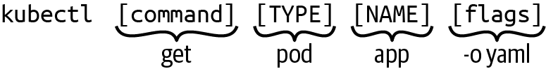

# Kubernetes_Tutorials <!-- omit in toc -->
## Author: Chetan <!-- omit in toc -->

- [Kubernetes: Introduction ](#kubernetes-introduction-)
- [Kubernetes: Components ](#kubernetes-components-)
  - [Control Plane ](#control-plane-)
  - [Worker Nodes ](#worker-nodes-)
- [Kubernetes Single server Setup using Minikube ](#kubernetes-single-server-setup-using-minikube-)
- [Kubernetes Single server Setup using Docker Desktop ](#kubernetes-single-server-setup-using-docker-desktop-)
- [Kubernetes Cluster Setup using Vagrant ](#kubernetes-cluster-setup-using-vagrant-)
  - [Prerequisites](#prerequisites)
- [The Kubernetes Client ](#the-kubernetes-client-)
- [Kubernetes Objects ](#kubernetes-objects-)
- [Kubernetes Object Management ](#kubernetes-object-management-)
- [Interaction between Kubernetes master and nodes ](#interaction-between-kubernetes-master-and-nodes-)
- [Used aliases](#used-aliases)

## Kubernetes: Introduction 
Kubernetes is an open source orchestrator for deploying containerized applications. Kubernetes was originally developed by Google, inspired by a decade of experience deploying scalable, reliable systems in containers via application-oriented APIs. Kubernetes is a platform for managing application containers across multiple hosts. It provides lots of management features for contain-oriented applications, such as auto scaling, rolling deployment, compute resource, and volume management. Same as the nature of containers, it's designed to run anywhere, so we're able to run it on a bare metal, in our data center, on the public cloud, or even hybrid cloud.
Kubernetes has grown to be the product of a rich and growing open source community.

## Kubernetes: Components 

Kubernetes includes two major players:
- Masters: The Master is the heart of Kubernetes, which controls and schedules all the activities in the cluster. Also called the Control plane
- Nodes: Nodes are the workers that run our containers. A node is a single host. It may be a physical or virtual machine. Its job is to run pods.

### Control Plane 
Manage the overall state of the cluster.
Control Plane Components

- kube-apiserver: The core component server that exposes the Kubernetes HTTP API. The API server provides an HTTP/HTTPS server, which provides a RESTful API for all the components in the Kubernetes master. For example, we could GET resource status, such as pod, POST to create a new resource and also watch a resource. API server reads and updates etcd, which is Kubernetes' backend data store.
- etcd: Consistent and highly-available key value store for all API server data. etcd is an open source distributed key-value store (https://coreos.com/etcd). Kubernetes stores all the RESTful API objects here. etcd is responsible for storing and replicating data.
- kube-scheduler: Scheduler decides which node is suitable for pods to run on, according to the resource capacity or the balance of the resource utilization on the node. It also considers spreading the pods in the same set to different nodes.
- kube-controller-manager: Runs controllers to implement Kubernetes API behavior. The Controller Manager controls lots of different things in the cluster. Replication Controller Manager ensures all the ReplicationControllers run on the desired container amount. Node Controller Manager responds when the nodes go down, it will then evict the pods. Endpoint Controller is used to associate the relationship between services and pods. Service Account and Token Controller are used to control default account and API access tokens.
- cloud-controller-manager (optional): Integrates with underlying cloud provider(s).

All the components can run on different hosts with clustering.

### Worker Nodes 
Node components need to be provisioned and run on every node, which report the runtime status of the pod to the maste
Worker Node Components
- Kubelet: The kubelet is the Kubernetes representative on the node. It oversees communicating with the master components and manage the running pods. That includes the following:
  - Download pod secrets from the API server
  - Mount volumes
  - Run the pod's container (Docker or Rkt)
  - Report the status of the node and each pod
  - Run container liveness probes
- kube-proxy: The kube proxy does low-level network housekeeping on each node. It refects the Kubernetes services locally and can do TCP and UDP forwarding. It finds cluster IPs via environment variables or DNS. Proxy handles the routing between pod load balancer (a.k.a. service) and pods, it also provides the routing from outside to service. There are two proxy modes, userspace and iptables. Userspace mode creates large overhead by switching kernel space and user space. Iptables mode, on the other hand, is the latest default proxy mode. It changes iptables NAT in Linux to achieve routing TCP and UDP packets across all containers.
- Container runtime: Software responsible for running containers. Common container runtime engines are:
  - containerd
  - CRI-O
  - Docker Engine
  - Mirantis Container Runtime

## Kubernetes Single server Setup using Minikube 
Follow the official documentation for installing [Minikube](https://minikube.sigs.k8s.io/docs/start/?arch=%2Fwindows%2Fx86-64%2Fstable%2F.exe+download)

## Kubernetes Single server Setup using Docker Desktop 
Install Docker Desktop on your Windows or Linux Machine, and enable Kuberentes

## Kubernetes Cluster Setup using Vagrant 
### Credit (https://github.com/techiescamp)  <!-- omit in toc -->
For cluster setup using Vagrant, I have followed the below repo from techiescamp:
https://github.com/techiescamp/vagrant-kubeadm-kubernetes 
You can also refer:
https://devopscube.com/kubernetes-cluster-vagrant/ 
although it seems to not include latest updates.

### Prerequisites
- Working Vagrant setup
- VMWare
- 8 Gig + RAM workstation as the Vms use 3 vCPUS and 4+ GB RAM

Download and install vagrant for your OS (Windows or Linux or MacOS) using the below link:
https://developer.hashicorp.com/vagrant/install?product_intent=vagrant
Also you will need a VMware which vagrant will use to create VMs. I have used Oracle VirtualBox on my Windows Machine.
Steps:
- $ git clone https://github.com/scriptcamp/vagrant-kubeadm-kubernetes.git
- $ cd vagrant-kubeadm-kubernetes
- $ vagrant up
- Copy configs/config to ~/.kube
  or
  $ export KUBECONFIG=$(pwd)/configs/config
- $ vagrant ssh controlplane
- check if k8s cluster is working: $ kubectl get nodes

## The Kubernetes Client 
The official Kubernetes client is kubectl: a command-line tool for interacting with the Kubernetes API. kubectl can be used to manage most Kubernetes objects such as pods, ReplicaSets, and services. kubectl can also be used to explore and verify the overall health of the cluster.
A kubectl execution consists of a command, a resource type, a resource name, and optional command line flags:
$ kubectl [command] [TYPE] [NAME] [flags]

Some usage of kubectl (will explore more in subsequent topics):
- Check the version of the cluster that you are running:
$ kubectl version
- Get a simple diagnostic for the cluster.
$ kubectl get componentstatuses
- List out all of the nodes in our cluster:
$ kubectl get nodes

## Kubernetes Objects 
Kubernetes objects are the entries in the cluster, which are stored in etcd. They represent the desired state of your cluster. When we create an object, we send the request to API Server by kubectl or RESTful API. API Server will store the state into etcd and interact with other master components to ensure the object exists. Every object has its own name and unique ID. Kubernetes uses object name as part of a resource URL to API Server, so it must be the combination of lower case of alphanumeric characters, dash and dot, less than 254 characters.
Kubernetes objects are persistent entities in the Kubernetes system. Kubernetes uses these entities to represent the state of your cluster. Specifically, they can describe:
- What containerized applications are running (and on which nodes)
- The resources available to those applications
- The policies around how those applications behave, such as restart policies, upgrades, and fault-tolerance.
Almost every Kubernetes object includes two nested object fields that govern the object's configuration: the object spec and the object status.
- Object spec provides a description of the characteristics you want the resource to have: its desired state.
- The status describes the current state of the object, supplied and updated by the Kubernetes system and its components.

## Kubernetes Object Management 
You can create objects in a Kubernetes cluster in two ways: imperatively or declaratively.
- Imperative Approach: The imperative method for object creation does not require a manifest definition. You would use the kubectl run or kubectl create command to create an object on the fly. Any configuration needed at runtime is provided by command-line options. The benefit of this approach is the fast turnaround time without the need to wrestle with YAML structures:
$ kubectl run frontend --image=nginx --restart=Never --port=80
- Declarative Approach: The declarative approach creates objects from a manifest file (in most cases, a YAML file) using the kubectl create or kubectl apply command. The benefit of using the declarative method is reproducibility and improved maintenance, as the file is checked into version control in most cases. The declarative approach is the recommended way to create objects in production environments. We will see these approach in details in subsequent sections.
- Hybrid Approach: Sometimes, you may want to go with a hybrid approach. You can start by using the imperative method to produce a manifest file without actually creating an object. You do so by executing the kubectl run command with the command-line options -o yaml and --dry-run=client:
$ kubectl run frontend --image=nginx --restart=Never --port=80 -o yaml --dry-run=client > pod.yaml

## Interaction between Kubernetes master and nodes 
In the following graph, the client uses kubectl to send requests to the API server; API server responds to the request, pushes and pulls the object information from etcd. Scheduler determines which node should be assigned to do the tasks (for example, run pods). Controller Manager monitors the running tasks and responds if any undesired state occurs. On the other hand, the API server fetches the logs from pods by kubelet, and is also a hub between other master components.

## Used aliases
Throughout this tutorial, I may use some aliases which I am mentioning below. This list can be updated later on.
